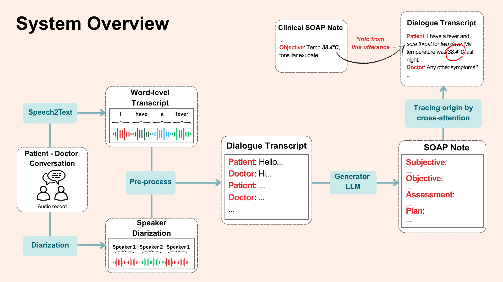
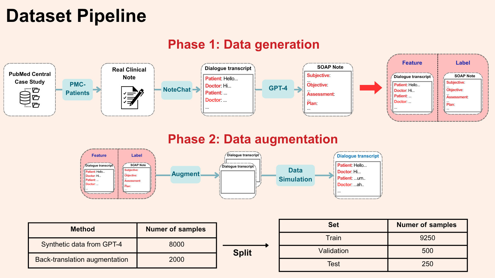

# dialogue_to_soap_note

A research repository to convert clinical dialogues into structured SOAP notes using a pipeline of speech-to-text, diarization, role classification, and summarization (fine-tuned LLMs).

See the demo here: [thesis-fe-gray.vercel.app](https://thesis-fe-gray.vercel.app/)

## Table of contents
- [Overview](#overview)
- [Models used](#models-used)
- [Quick start](#quick-start)
- [Repository structure](#repository-structure)

## Overview
This repo implements an end-to-end pipeline that:
1. Converts audio dialogue to transcripts (Speech2Text).
2. Performs speaker diarization.
3. Classifies utterance roles (Doctor / Patient / Other).
4. Generates structured SOAP notes (Summarization).

## Models used
- Transcription:
  - OpenAI Whisper (large-v3) 
- Speaker diarization:
  - pyannote.audio (Pytorch-based framework)
- Role classification:
  - Bert-base-uncased
- SOAP-note generation:
  - Fine-tuned with LoRA: BioBART, Pegasus-PubMed, Pegasus-Xsum
  - Prompt engineering: LLaMA-3 (8B instruct),  Omihealth (8B)

## Quick start
1. Install Python environment (recommend virtualenv / conda) and Jupyter/Colab.
2. Open and run the orchestrating notebook:
   - [Pipeline/pipeline_FINAL.ipynb](Pipeline/pipeline_FINAL.ipynb)
3. To inspect transcripts and conventions:
   - [Convention/1_Transcript_Whisper.json](Convention/1_Transcript_Whisper.json)
   - [Convention/4_Complete_Transcript.json](Convention/4_Complete_Transcript.json)
4. Role classification and summarization experiments are available as notebooks under [RoleClassifier/](RoleClassifier/) and [Summarization/](Summarization/).

Notes:
- Many notebooks include Colab drive mount steps. Adapt these cells if running locally.
- Hardware: fine-tuning notebooks expect GPU resources (A100/T4/L4 referenced in notebooks).

## Repository structure
- [/Convention](Convention/) : transcription and annotation formats used across the project (example: transcripts, combined transcripts, and final summaries).
  - Transcripts along with timestamps and token-level times. See [Convention/1_Transcript_Whisper.json](Convention/1_Transcript_Whisper.json).
  - Combined utterance-level transcripts. See [Convention/4_Complete_Transcript.json](Convention/4_Complete_Transcript.json).
  - Final structured SOAP notes. See [Convention/7_Complete_Summary.json](Convention/7_Complete_Summary.json).
- [/Pipeline](Pipeline/) : main orchestration notebooks and pipeline code.
- [/RoleClassifier](RoleClassifier/) : role-classifier notebooks.
- [/Speech2Text](Speech2Text/) : S2T models & utilities (audio preprocessing, whisper configs).
- [/Summarization](Summarization/) : fine-tuning and evaluation for clinical summarization models.
  - Example finetuning notebooks: [Summarization/3_Fine_Tune_LLM/bart/bio_bart/biobart_lora_1.ipynb](Summarization/3_Fine_Tune_LLM/bart/bio_bart/biobart_lora_1.ipynb)
  - Example evaluation/test outputs: [Summarization/3_Fine_Tune_LLM/bart/bio_bart/eval_test_soap_50.csv](Summarization/3_Fine_Tune_LLM/bart/bio_bart/eval_test_soap_50.csv)

- [/assets/diagrams/files](assets/diagrams/files/) : architecture and DB diagrams.